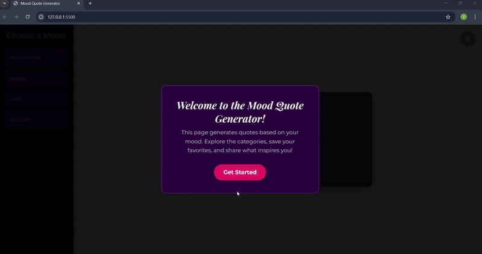

# Mood Quote Generator 🚀

A dynamic and feature-rich quote application built with vanilla JavaScript, HTML, and CSS. This project provides a personalized experience, allowing users to get quotes that match their mood and save their favorites.

[**View Live Demo**](https://venkatesh-code14.github.io/smart-quote-generator/)

---

### ## Preview

*A short GIF showing the main features: selecting a mood from the sidebar, saving a favorite quote, and the smooth, gradient background transitions.*

---

### ## About The Project

This project was built to practice and showcase core front-end development skills without relying on any external frameworks. It started as a simple idea for a random quote generator and evolved into a more complex application with a focus on creating a polished and interactive user experience.

The application is completely self-contained, using a local library of quotes and backgrounds for a fast and reliable experience.

---

### ## Key Features

* ** Mood-Based Themes:** A permanent sidebar allows users to select a mood (Motivational, Happy, Love, or Wisdom). The app then provides a relevant quote and a beautiful, themed `linear-gradient` background.
* **  Persistent Favorites:** Users can save their favorite quotes with a single click. The app uses **`localStorage`** to remember these favorites, so they are still available even after the user closes and reopens the browser.
* ** Polished UI:** The user interface is designed to be intuitive and engaging, with smooth, cross-fading background transitions and a clean, responsive layout.
* **🔗 Share Functionality:** Users can easily copy a quote to their clipboard or share it on social media.

---

### ## Technologies Used

* HTML5
* CSS3 (Flexbox, Transitions, Gradients)
* Vanilla JavaScript (ES6+)
